# Easy Genomics — Platform Architecture

## Table of Contents

1. [Platform Overview](#1-platform-overview)
2. [High-Level Architecture](#2-high-level-architecture)
3. [AWS Infrastructure](#3-aws-infrastructure)
4. [Back-End: CDK Stacks](#4-back-end-cdk-stacks)
5. [Back-End: Lambda Domains](#5-back-end-lambda-domains)
6. [Services Layer](#6-services-layer)
7. [Async Event Architecture](#7-async-event-architecture)
8. [Front-End Architecture](#8-front-end-architecture)
9. [Authentication Flow](#9-authentication-flow)
10. [Key Data Flows](#10-key-data-flows)
11. [Data Model](#11-data-model)
12. [CI/CD Pipeline](#12-cicd-pipeline)
13. [Local Development Architecture](#13-local-development-architecture)
14. [Configuration System](#14-configuration-system)

---

## 1. Platform Overview

Easy Genomics is a multi-tenant web application that simplifies genomic analysis for bioinformaticians. It acts as a
unified control plane over two genomics compute platforms:

- **AWS HealthOmics** — managed genomics workflows (Nextflow, WDL)
- **Seqera Tower (nf-tower)** — Nextflow pipeline orchestration

**Key concepts:**

| Concept             | Description                                                                          |
| ------------------- | ------------------------------------------------------------------------------------ |
| **Organization**    | Top-level tenant. Groups laboratories and users.                                     |
| **Laboratory**      | A workspace within an org. Has its own S3 bucket, users, and workflow access.        |
| **User Roles**      | System Admin → Org Admin → Lab Manager → Lab Technician                              |
| **Run**             | A single workflow/pipeline execution tied to a Laboratory.                           |
| **Workflow Access** | Per-laboratory allowlist controlling which HealthOmics/Seqera workflows are visible. |

**Technology stack:**

| Layer          | Technology                                |
| -------------- | ----------------------------------------- |
| Front-End      | Nuxt 3 / Vue 3, Pinia, Tailwind CSS       |
| Back-End       | AWS Lambda (TypeScript), API Gateway REST |
| Infrastructure | AWS CDK (TypeScript) / CloudFormation     |
| Database       | DynamoDB                                  |
| Auth           | AWS Cognito + JWT                         |
| Messaging      | SQS (FIFO)                                |
| Storage        | S3                                        |
| Email          | SES                                       |
| Monorepo       | NX + PNPM workspaces + Projen             |

---

## 2. High-Level Architecture

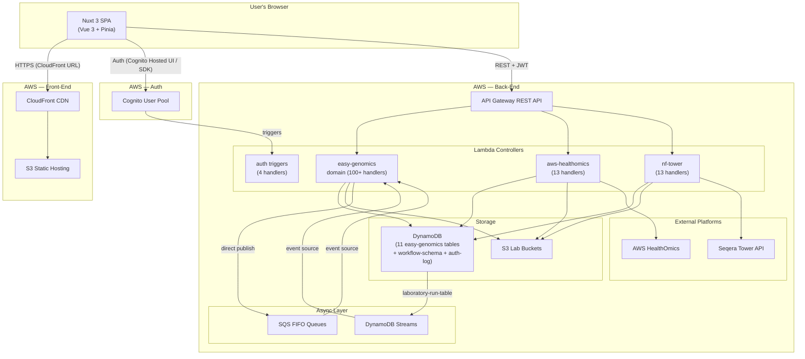

Direct publish to SQS replaced a former SNS → SQS hop; each topic had exactly one subscriber, so the SNS layer was
collapsed to save resources. `sns-service.ts` and `sns-construct.ts` remain in the codebase but are unused by any
current stack.

---

## 3. AWS Infrastructure

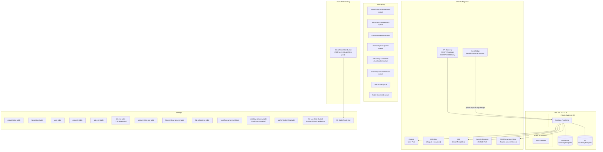

---

## 4. Back-End: CDK Stacks

All infrastructure is defined in TypeScript CDK and deployed via CloudFormation. The entry point is
`packages/back-end/src/main.ts`.

There are **two top-level stacks**, each rendered to its own CloudFormation template (each with its own 500-resource
limit). `EasyGenomicsApiStack` was split out of `BackEndStack` because the Easy Genomics route set alone pushed the
shared template past 500 resources.

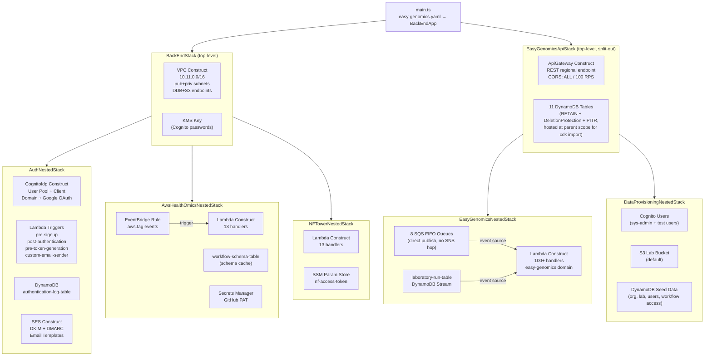

### Stack → Construct mapping

| Stack                       | Top-level? | Constructs used                                                       |
| --------------------------- | ---------- | --------------------------------------------------------------------- |
| BackEndStack                | ✅         | VpcConstruct, KMS                                                     |
| AuthNestedStack             | —          | CognitoIdpConstruct, LambdaConstruct, DynamoDbConstruct, SesConstruct |
| AwsHealthOmicsNestedStack   | —          | LambdaConstruct, DynamoDbConstruct, SecretsManager, EventBridge       |
| NFTowerNestedStack          | —          | LambdaConstruct, SSM                                                  |
| EasyGenomicsApiStack        | ✅         | ApiGatewayConstruct, DynamoConstruct (×11 tables, RETAIN)             |
| EasyGenomicsNestedStack     | —          | LambdaConstruct (×N), SqsConstruct (×8)                               |
| DataProvisioningNestedStack | —          | CognitoUserConstruct, S3Construct, AwsCustomResource (DDB seed)       |
| FrontEndStack               | ✅         | WwwHostingConstruct (S3 + CloudFront + ACM + Route53)                 |

`AuthNestedStack`, `AwsHealthOmicsNestedStack`, and `NFTowerNestedStack` are children of `BackEndStack`.
`EasyGenomicsNestedStack` and `DataProvisioningNestedStack` are children of `EasyGenomicsApiStack`.

---

## 5. Back-End: Lambda Domains

Lambda handlers are auto-discovered from `*.lambda.ts` files. The `LambdaConstruct` maps filename prefixes to HTTP
methods and registers them with API Gateway.

```
create-*   → POST
read-*     → GET    (with {id} path param)
list-*     → GET
update-*   → PUT
delete-*   → DELETE
cancel-*   → DELETE
edit-*     → PUT
add-*      → POST
remove-*   → DELETE
search-*   → GET
request-*  → POST
confirm-*  → POST
process-*  → SQS event source (no HTTP route)
```

### Domain: `easy-genomics` (100+ handlers)

The diagram below shows a representative subset by feature area, not the full handler list — the domain has grown well
past the illustrated set since this doc was first written.

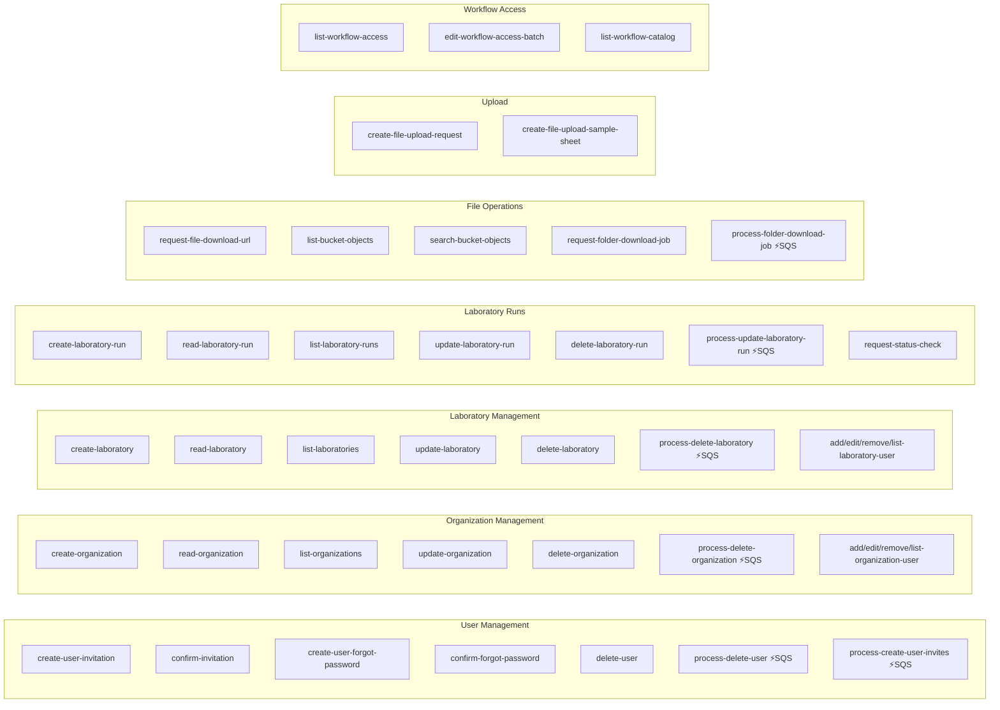

### Domain: `aws-healthomics` (13 handlers)

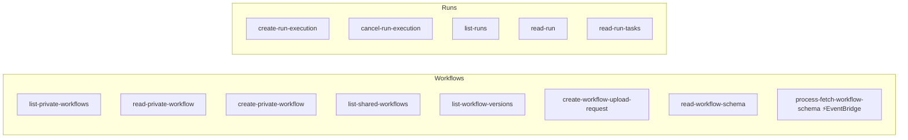

### Domain: `nf-tower` / Seqera (13 handlers)

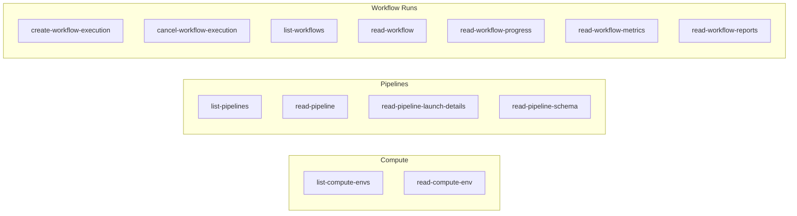

### Auth Cognito Triggers (4 handlers)

| Handler                        | Trigger            | Purpose                           |
| ------------------------------ | ------------------ | --------------------------------- |
| `process-pre-signup`           | PreSignUp          | Validates sign-up attempt         |
| `process-post-authentication`  | PostAuthentication | Writes auth event to DynamoDB     |
| `process-pre-token-generation` | PreTokenGeneration | Injects custom claims into JWT    |
| `process-custom-email-sender`  | CustomEmailSender  | Delivers emails via SES templates |

---

## 6. Services Layer

Lambda handlers never call AWS SDKs directly — they go through service classes in `packages/back-end/src/app/services/`.

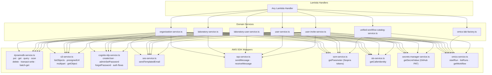

`sns-service.ts` and `sns-construct.ts` still exist in the codebase but have no callers — async publishing goes straight
to `sqs-service.ts` (see [§7](#7-async-event-architecture)).

---

## 7. Async Event Architecture

Cascading deletes and async processing publish directly to FIFO SQS queues consumed by `process-*` Lambdas — there is no
SNS hop. Each former SNS topic had exactly one SQS subscriber, so the topic was collapsed away; messages still use a
legacy `SnsProcessingEvent`-shaped envelope (`{ Operation, Type, Record }`) so consumers that switch on `Type` didn't
need to change.

The laboratory-run table also has a DynamoDB Stream subscriber (`process-laboratory-run-stream`) that drives the TTL →
S3 deletion cascade — a second async path that doesn't go through SQS at all.

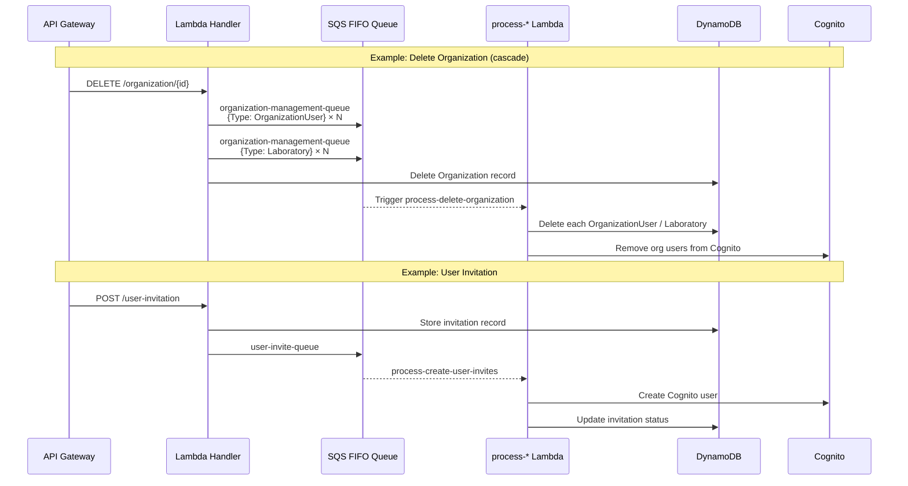

### SQS Queue → Lambda mapping

| SQS Queue                                   | Lambda Processor                         | Trigger                                             |
| ------------------------------------------- | ---------------------------------------- | --------------------------------------------------- |
| organization-management-queue               | process-delete-organization              | DELETE /organization (cascades to org users + labs) |
| laboratory-management-queue                 | process-delete-laboratory                | DELETE /laboratory                                  |
| user-management-queue                       | process-delete-user                      | DELETE /user                                        |
| laboratory-run-update-queue                 | process-update-laboratory-run            | Run status change                                   |
| laboratory-run-failure-classification-queue | process-classify-laboratory-run-failure  | Failed run → LLM classification                     |
| laboratory-run-notification-queue           | process-notify-laboratory-run-completion | Run completion → notification                       |
| user-invite-queue                           | process-create-user-invites              | POST /user-invitation                               |
| folder-download-queue                       | process-folder-download-job              | POST /request-folder-download-job                   |

`laboratory-run-table` DynamoDB Stream → `process-laboratory-run-stream` (TTL-expired records → cascading S3 deletion)
is a separate event source, not a queue.

---

## 8. Front-End Architecture

The front-end is a **Nuxt 3** SPA. It's statically built and served from CloudFront → S3.

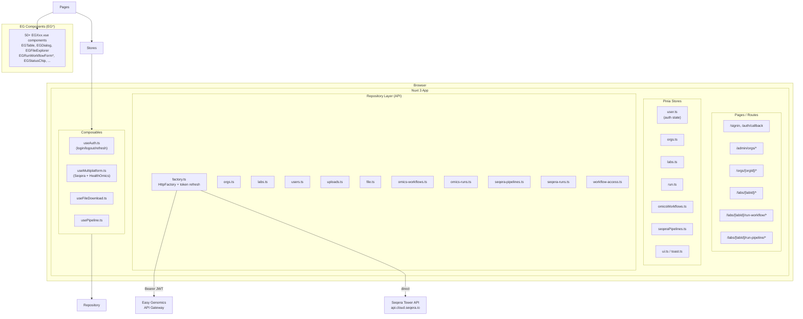

### Repository → API Gateway mapping

| Repository Module   | API Domain      | Key Endpoints                           |
| ------------------- | --------------- | --------------------------------------- |
| orgs.ts             | easy-genomics   | /organization/\*                        |
| labs.ts             | easy-genomics   | /laboratory/\*                          |
| users.ts            | easy-genomics   | /user/_, /user-invitation/_             |
| uploads.ts          | easy-genomics   | /upload/\*                              |
| file.ts             | easy-genomics   | /file/_, /bucket/_                      |
| workflow-access.ts  | easy-genomics   | /workflow-access/\*, /workflow-catalog  |
| omics-workflows.ts  | aws-healthomics | /private-workflow/_, /shared-workflow/_ |
| omics-runs.ts       | aws-healthomics | /run-execution/_, /run/_                |
| seqera-pipelines.ts | nf-tower        | /pipeline/_, /compute-envs/_            |
| seqera-runs.ts      | nf-tower        | /workflow-execution/_, /workflow/_      |

### Front-End Route → Feature map

| Route                             | Feature                                |
| --------------------------------- | -------------------------------------- |
| `/signin`                         | Cognito hosted UI or username/password |
| `/auth/callback`                  | OAuth redirect handler (Google SSO)    |
| `/admin/orgs/`                    | System Admin: manage all organizations |
| `/orgs/[orgId]/`                  | Org Admin: manage org members and labs |
| `/labs/`                          | User's laboratories list               |
| `/labs/[labId]/`                  | Lab dashboard: runs, files, users      |
| `/labs/[labId]/run-workflow/[id]` | Launch HealthOmics workflow            |
| `/labs/[labId]/run-pipeline/[id]` | Launch Seqera pipeline                 |
| `/labs/[labId]/run/[runId]`       | View run details + status              |
| `/labs/[labId]/omics-run/[id]`    | HealthOmics run details                |
| `/labs/[labId]/seqera-run/[id]`   | Seqera run details                     |
| `/labs/[labId]/sample-sheet`      | Upload sample sheet CSV                |

---

## 9. Authentication Flow

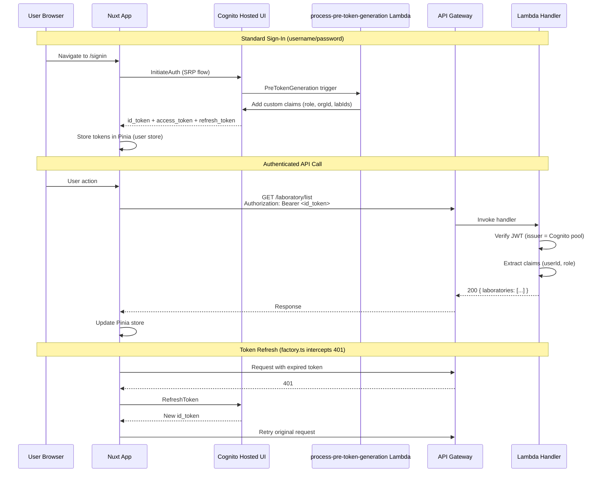

### Cognito User Pool configuration

| Setting         | Value                                                  |
| --------------- | ------------------------------------------------------ |
| Password policy | Min 8 chars, 1 number, 1 special, 1 upper, 1 lower     |
| Auth flows      | USER_SRP_AUTH, ALLOW_REFRESH_TOKEN_AUTH                |
| MFA             | Optional TOTP                                          |
| Domain          | `{name-prefix}-easy-genomics` (Cognito hosted UI)      |
| Google OAuth    | Configured via google-client-id + google-client-secret |
| Callback URLs   | `{app-domain}/auth/callback`                           |

---

## 10. Key Data Flows

### Run a HealthOmics Workflow

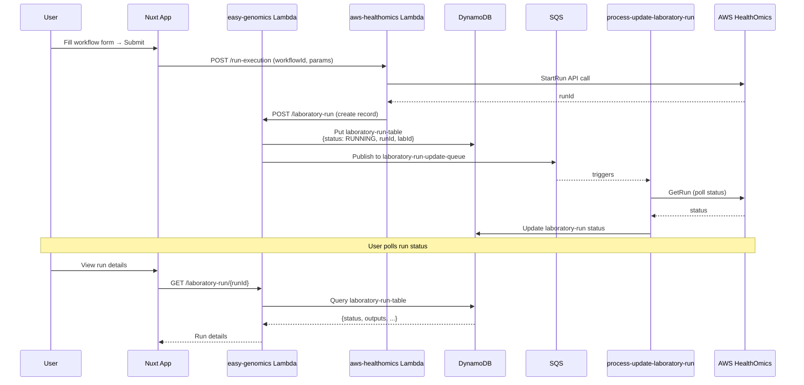

### File Upload Flow

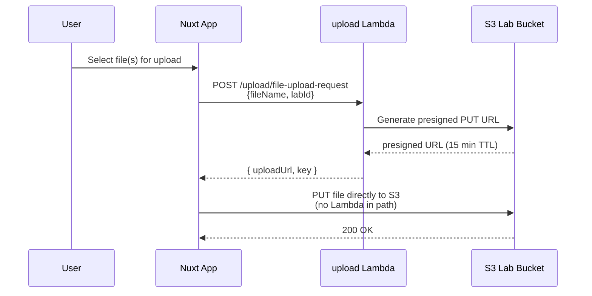

### File Download Flow

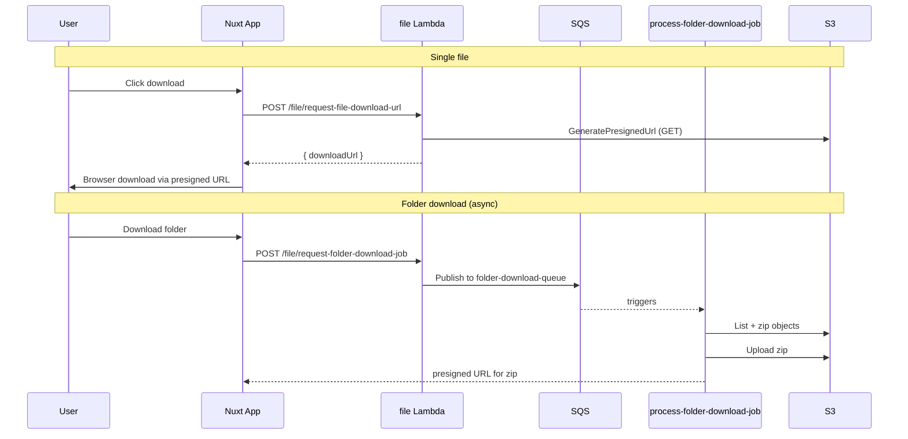

### User Invitation Flow

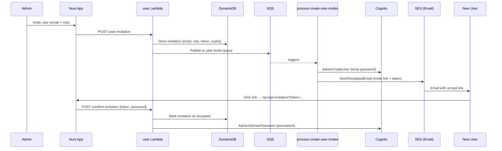

---

## 11. Data Model

### DynamoDB Tables

```mermaid
erDiagram
    ORGANIZATION {
        string OrganizationId PK
        string Name
        string Status
        string CreatedAt
    }
    LABORATORY {
        string OrganizationId PK
        string LaboratoryId SK
        string Name
        string S3Bucket
        string Status
    }
    USER {
        string UserId PK
        string Email
        string Status
        string SystemAdmin
    }
    ORGANIZATION_USER {
        string OrganizationId PK
        string UserId SK
        string Role
        string Status
    }
    LABORATORY_USER {
        string LaboratoryId PK
        string UserId SK
        string OrganizationId
        string Role
        string Status
    }
    LABORATORY_RUN {
        string LaboratoryId PK
        string RunId SK
        string UserId
        string OrganizationId
        string Status
        string Platform
        number ExpiresAt
    }
    LABORATORY_WORKFLOW_ACCESS {
        string LaboratoryId PK
        string WorkflowKey SK
    }
    LABORATORY_S3_ACCESS {
        string LaboratoryId PK
        string BucketName SK
    }
    LABORATORY_DATA_TAGGING {
        string LaboratoryId PK
        string Sk SK
        string Gsi1Pk
        string Gsi1Sk
    }
    WORKFLOW_RUN_PRESET {
        string LaboratoryId PK
        string Sk SK
    }
    UNIQUE_REFERENCE {
        string Value PK
        string Type SK
    }
    WORKFLOW_SCHEMA {
        string WorkflowId PK
        string Version SK
        string Schema
    }
    AUTH_LOG {
        string UserName PK
        string DateTime SK
        string EventType
    }

    ORGANIZATION ||--o{ LABORATORY : "contains"
    ORGANIZATION ||--o{ ORGANIZATION_USER : "has members"
    LABORATORY ||--o{ LABORATORY_USER : "has members"
    LABORATORY ||--o{ LABORATORY_RUN : "has runs"
    LABORATORY ||--o{ LABORATORY_WORKFLOW_ACCESS : "allowlist"
    LABORATORY ||--o{ LABORATORY_S3_ACCESS : "bucket allowlist"
    LABORATORY ||--o{ LABORATORY_DATA_TAGGING : "tags S3 objects"
    LABORATORY ||--o{ WORKFLOW_RUN_PRESET : "saved run presets"
    USER ||--o{ ORGANIZATION_USER : "belongs to"
    USER ||--o{ LABORATORY_USER : "belongs to"
    USER ||--o{ LABORATORY_RUN : "creates"
```

### Role Hierarchy

```
System Admin
 └── Org Admin (per Organization)
      └── Lab Manager (per Laboratory)
           └── Lab Technician (per Laboratory)
```

| Role           | Capabilities                                       |
| -------------- | -------------------------------------------------- |
| System Admin   | Manage all orgs, all users, platform-wide settings |
| Org Admin      | Manage org labs and org users                      |
| Lab Manager    | Manage lab users, workflow access, run workflows   |
| Lab Technician | View runs, upload files, run workflows             |

---

## 12. CI/CD Pipeline

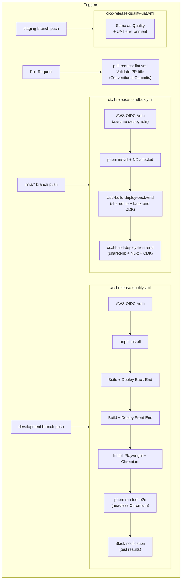

### CI/CD Environment Variables

| Variable                      | Used for                           |
| ----------------------------- | ---------------------------------- |
| `AWS_ACCOUNT_ID`              | CDK deploy target                  |
| `AWS_REGION`                  | CDK + Lambda region                |
| `ENV_TYPE`                    | `dev` / `pre-prod` / `prod`        |
| `ENV_NAME`                    | Stack name prefix (e.g. `quality`) |
| `APP_DOMAIN_NAME`             | CloudFront + Route 53              |
| `AWS_HOSTED_ZONE_ID`          | Route 53 hosted zone (prod only)   |
| `AWS_CERTIFICATE_ARN`         | ACM cert (prod only)               |
| `JWT_SECRET_KEY`              | Lambda JWT verification            |
| `SYSTEM_ADMIN_EMAIL/PASSWORD` | E2E test credentials               |
| `SEQERA_API_BASE_URL`         | Optional self-hosted Seqera        |

---

## 13. Local Development Architecture

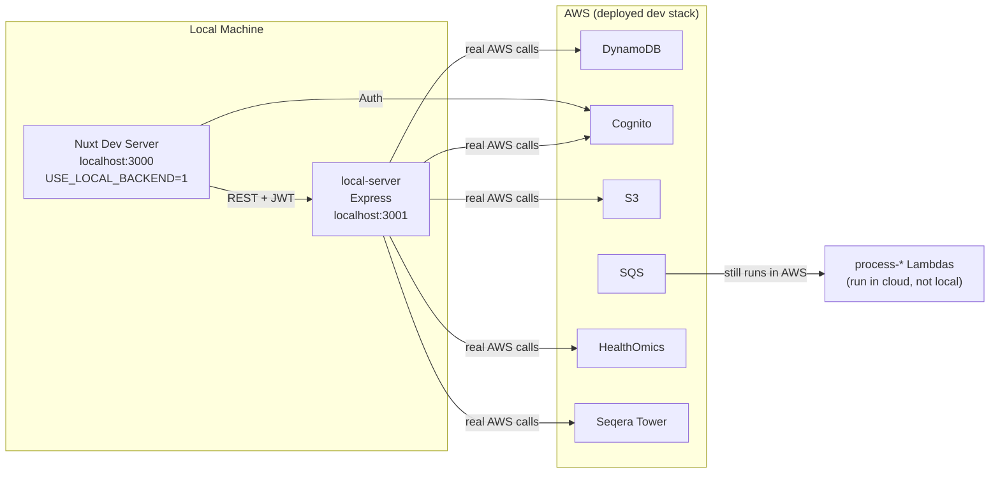

### How local-server works

The local server (`packages/back-end/src/local-server/`) runs Lambda handlers in-process inside an Express server:

1. **route-registry.ts** — scans `*.lambda.ts` files, maps filename prefix → HTTP method, registers Express routes
2. **lambda-invoker.ts** — dynamically `import()`s the handler, invokes the exported `handler` function
3. **event-builder.ts** — converts the Express `Request` into an `APIGatewayProxyEvent` shape
4. **auth-middleware.ts** — validates Cognito JWT (or skips if `SKIP_JWT_VERIFY=true`)

`process-*` handlers are excluded from HTTP routes — they only run via SQS in the deployed stack.

### Local dev commands

```bash
# From repo root — build shared-lib first (required once)
pnpm run build-back-end

# Terminal 1 — local API server
cd packages/back-end && pnpm run local-server
# or with watch: pnpm run local-server:watch

# Terminal 2 — front-end dev server pointing at local API
cd packages/front-end && USE_LOCAL_BACKEND=1 pnpm run nuxt-dev

# Regenerate front-end AWS config after re-deploying
cd packages/front-end && pnpm run nuxt-load-settings
```

### `.env.local` required variables

| Variable                      | Description                                     |
| ----------------------------- | ----------------------------------------------- |
| `NAME_PREFIX`                 | e.g. `dev-demo` — used for DynamoDB table names |
| `ACCOUNT_ID`                  | AWS account ID                                  |
| `REGION`                      | Must match Cognito pool region                  |
| `COGNITO_USER_POOL_ID`        | Must match what the front-end uses to sign in   |
| `COGNITO_USER_POOL_CLIENT_ID` | From the same Cognito pool                      |
| `JWT_SECRET_KEY`              | Must match the deployed stack's value           |

---

## 14. Configuration System

All configuration flows from a single source: `config/easy-genomics.yaml`.

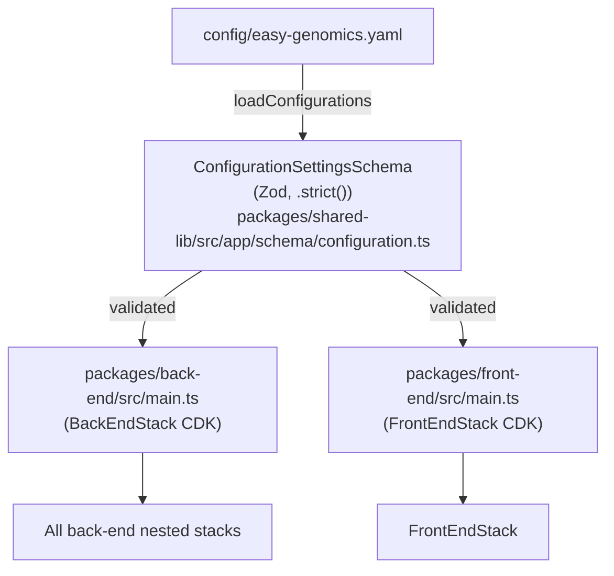

**Important:** The schema uses `.strict()` — any unrecognized key in the yaml causes the entire configuration to be
silently rejected (returns empty array → throws "Configuration missing / invalid"). Always validate new fields against
`ConfigurationSettingsSchema`.

### Config key reference

| Key                            | Required  | Description                                                                               |
| ------------------------------ | --------- | ----------------------------------------------------------------------------------------- |
| `aws-account-id`               | Yes       | AWS account ID (quote if starts with `00`)                                                |
| `aws-region`                   | Yes       | AWS region (e.g. `us-west-2`)                                                             |
| `env-type`                     | Yes       | `dev` / `pre-prod` / `prod`                                                               |
| `app-domain-name`              | Yes       | Base domain (CloudFront or Route53)                                                       |
| `aws-hosted-zone-id`           | prod only | Route 53 hosted zone                                                                      |
| `aws-certificate-arn`          | prod only | ACM certificate                                                                           |
| `aws-easy-genomics-api-url`    | Optional  | Override Front-End's easy-genomics API URL when the back-end splits it into its own stack |
| `google-client-id`             | Optional  | Google SSO                                                                                |
| `google-client-secret`         | Optional  | Google SSO                                                                                |
| `cognito-domain-prefix`        | Optional  | SSO callback domain                                                                       |
| `callback-urls`                | Optional  | Cognito OAuth callback                                                                    |
| `logout-urls`                  | Optional  | Cognito OAuth logout                                                                      |
| `back-end.jwt-secret-key`      | Optional  | JWT signing (auto-generated if absent)                                                    |
| `back-end.seqera-api-base-url` | Optional  | Self-hosted Seqera                                                                        |
| `back-end.vpc-peering.*`       | Optional  | VPC peering accepter details                                                              |
| `back-end.sys-admin-email`     | Yes       | Initial system admin                                                                      |
| `back-end.sys-admin-password`  | Yes       | Initial system admin password                                                             |
| `analytics.enabled`            | Optional  | Opt-in privacy-safe usage analytics (PostHog), off by default                             |
| `analytics.allow-dev`          | Optional  | Allow analytics on a `dev` env-type deployment                                            |
| `cost-explorer.enabled`        | Optional  | Deploys the daily Cost Explorer sync Lambda for billed-run-cost reporting                 |

The GitHub PAT used for nf-core schema fetches (`github-pat-secret-name`) is not part of `ConfigurationSettingsSchema` —
it's passed to `AwsHealthOmicsNestedStack` via CI/CD environment, not the yaml config.
